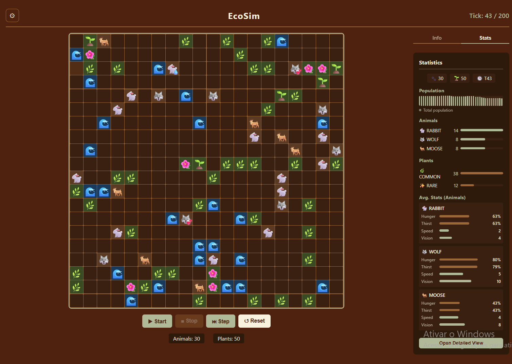
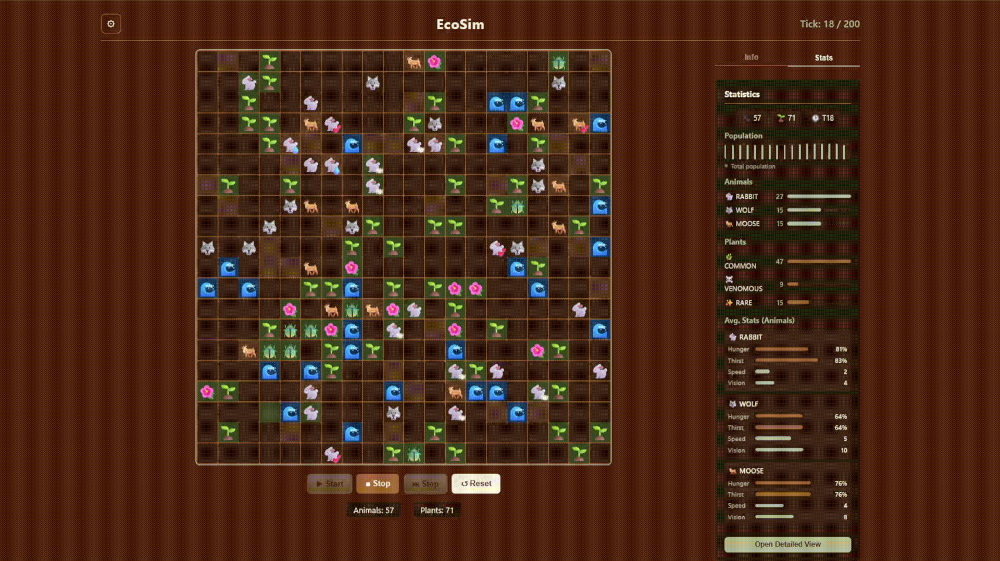
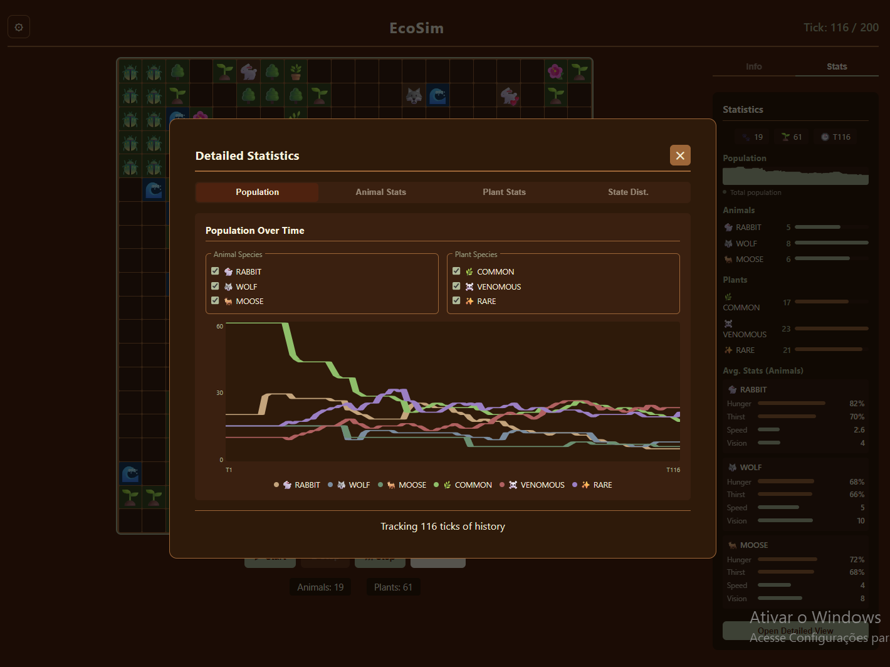
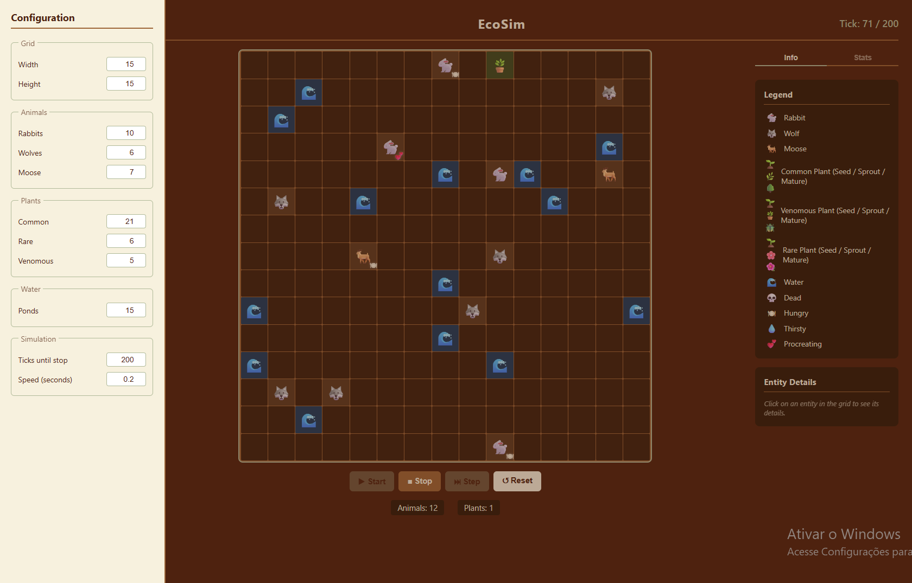

# EcoSim

A discrete-time ecosystem simulation built with TypeScript and Node, with a React frontend for real-time visualization. Entities live, compete for resources, reproduce, and pass genetic traits to their offspring — no scripted behaviors, just emergent dynamics from a set of rules.

---



---

## What it simulates

The world is a configurable grid populated with animals and plants. Each simulation tick, every entity acts according to its current state and the environment around it. Over time, populations grow and collapse, genetic traits spread through generations, and the balance between predators and prey shifts without any manual intervention.

Animals eat, drink, and reproduce. Plants grow, spread seeds, and get consumed. When resources run low, animals die. When pressure eases, populations recover.

---

## Features

- Three animal species — Rabbit, Wolf and Moose — each with distinct base stats for speed, vision radius, hunger and thirst capacity
- Three plant species — Common, Venomous and Rare — with different growth rates and nutritional values
- A* pathfinding for navigation around water obstacles
- Utility-based action priority: animals evaluate hunger, thirst and procreation urge each tick and act on the most critical need first
- Sexual reproduction for animals and asexual propagation for plants, both routed through the same inheritance pipeline
- Genetic inheritance with configurable per-gene transmission chance and random mutation at 5% per gene type per offspring
- Ten gene types that modify stats directly on the entity: `SPEED`, `VISION`, `HUNGER_MAX`, `THIRST_MAX`, `LIFESPAN`, `GROWTH_RATE`, `NUTRITIONAL_VALUE_MAX`, `DIET_SHIFT`, `RARE_PLANT` and `VENOMOUS_PLANT`
- Real-time UI with population graphs, per-species stat history, state distribution charts and a configurable simulation speed

---



---

## Architecture

The project is split into four layers that only communicate downward. Domain entities have no knowledge of systems; systems have no knowledge of the UI.

```
.
├── src/
│   ├── core/            Engine, World, TurnManager
│   │
│   ├── domain/
│   │   ├── entities/      Animal, Plant, LivingEntity
│   │   └── enums/         AnimalStates, PlantStates, DietTypes, GeneTypes
│   │
│   ├── shared/
│   │   ├── config/        ecosystemConfig — thresholds, intervals, diet maps
│   │   ├── interfaces/    AnimalActionsInterface, PlantActionsInterface, LivingEntityActionsInterface
│   │   └── types/         StatValue, Gene, Diet, Position, Distance, Interval
│   │
│   └── systems/
│       ├── movement/      SearchFood, SearchWater, MoveToProcreate, RandomlyMove
│       ├── inheritance/   plant_genes, animal_genes, other_genes, InheritanceSystem
│       ├── pathfinding/   PathfindingSystem (A*)
│       ├── reproduction/  ReproductionSystem
│       ├── vision/        VisionSystem
│       └── utils/         Calculations, Random
│
├── tests/             Core Tests, Domain Tests, Systems tests
│
└── ui/                React frontend (Vite)
    ├── components/    SimulationGrid, StatisticsPanel, DetailedStats,
    │                  EntityStats, ControlPanel, ConfigMenu, Legend
    ├── styles/
    └── utils/         statsTracker
```

The movement system uses the **Strategy pattern**: each animal state (`HUNGRY`, `THIRSTY`, `PROCREATING_SEASON`, `NORMAL`) maps to a strategy class that implements `entityMove(animal, world): boolean`. Adding a new behavior means registering a new strategy — nothing else changes.

The inheritance system follows the same pattern for genes: each `GeneType` maps to a `GeneStrategy` that knows how to apply that gene to a `LivingEntity`. The registry lookup is O(1) and the system works identically for animals and plants.

Action priority uses a **Utility AI** approach. Each tick, `MovementSystem` scores all applicable strategies using `urgency × priority weight`, where urgency is derived from how depleted the relevant stat is. The highest-scoring strategy executes first.

---

## Systems

### Movement

Four strategies cover all animal behavior. `RandomlyMove` handles the `NORMAL` state by picking a random valid adjacent cell each step. `SearchFood` and `SearchWater` locate the nearest target within vision radius and navigate toward it using A*. `MoveToProcreate` finds a compatible mate and moves adjacent to trigger reproduction.

The strategy registry maps each `AnimalState` to its strategy. Priority weights and stat thresholds live in `ecosystemConfig.ts` as named constants.

### Pathfinding

`PathfindingSystem.nextStep(from, to, world)` runs A* with Manhattan distance as the heuristic and returns only the next single step toward the destination. Strategies call this once per movement step inside their speed loop, so a fast animal takes multiple steps per tick. Water tiles are treated as impassable during traversal but are recognized as valid destinations for adjacency checks in `SearchWater`.

### Vision

`VisionSystem` queries `world.livingEntities` filtered by entity type, live state and Euclidean distance within the animal's `visionRadius`. It returns the closest qualifying target. Dead and withered entities are excluded at the filter level, so eating a plant that another animal killed in the same tick is not possible.

### Reproduction and Inheritance

`ReproductionSystem.procreate` creates an offspring animal, then delegates to `InheritanceSystem` in two sequential calls. `inheritCharacteristics` averages the parents' base stats — hunger capacity, speed, vision radius, lifespan. `inheritGenes` then selects genes from the combined parent gene pool with per-gene transmission probability, deduplicates by type, and runs a mutation pass over all gene types neither parent carries. Finally, each gene in the offspring's genome is applied via its registered strategy, potentially overriding the averaged stats.

Plant propagation works the same way. A mature plant has a 5% chance per tick of calling `propagatePlant`, which creates a seed of the same species in an adjacent free cell and routes it through the same `inheritCharacteristics → inheritGenes` pipeline — passing the parent as both `parent1` and `parent2`. Because genes are deduplicated before the transmission roll, each gene gets exactly one chance to be inherited rather than two.

---

## Statistics and observability

The UI ships with a statistics layer that runs independently from the simulation logic — `statsTracker` captures a snapshot of the world state every tick without the `Engine` or any system knowing it exists.

The sidebar shows live counts and sparklines per species, giving a quick read on whether a population is growing or collapsing. The detailed view goes further with four tabs: population over time across all species, individual animal stats (hunger, thirst, speed averages), plant stats (growth rate, nutritional value), and state distribution showing how many entities are currently `HUNGRY`, `THIRSTY` or in `PROCREATING_SEASON` at any given tick.

Because the snapshot history is kept in memory on the frontend, selecting an entity on the grid pulls its full current stat block — including inherited genes — directly from the live `World` reference, with no extra computation needed.



---

## Configuring the simulation

All parameters are accessible through the config panel in the UI without restarting.

| Parameter | What it controls |
|---|---|
| World width / height | Grid dimensions |
| Tick rate | Milliseconds between ticks |
| Max ticks | Stop condition (0 = run indefinitely) |
| Initial entity counts | Starting population per species |
| Water sources | Number of water tiles placed randomly |



Thresholds for when an animal enters `HUNGRY`, `THIRSTY` or `PROCREATING_SEASON` states are defined as named constants in `src/shared/config/ecosystemConfig.ts`.

---

## Running the project

**Requirements:** Node 18+

```bash
# Install dependencies
npm install

# Run the simulation (console output)
npm start

# Run the UI
cd ui
npm install
npm run dev

# Run tests
npm test
```

---

## Tech stack

- TypeScript
- Node.js
- React + Vite
- Jest

---

## What's next

- Pixel art sprites to replace the current emoji grid representation
- `WorldGenerator` for procedural map creation with water in clusters and balanced initial entity placement
- Species-specific behaviors: Wolf hunting priority toward Rabbit over Moose
- Hunt and escape system: methods for prey to flee
- Gene visualization in the entity detail panel
- Pattern change Genes: alter the base functionality of MovementSystem
